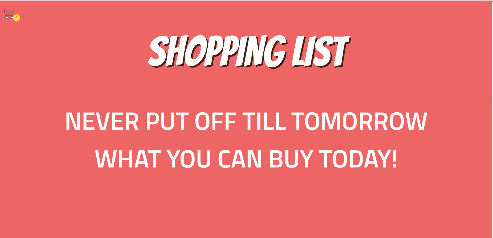
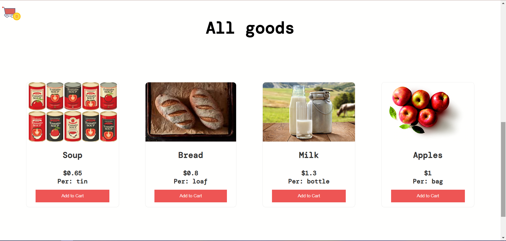
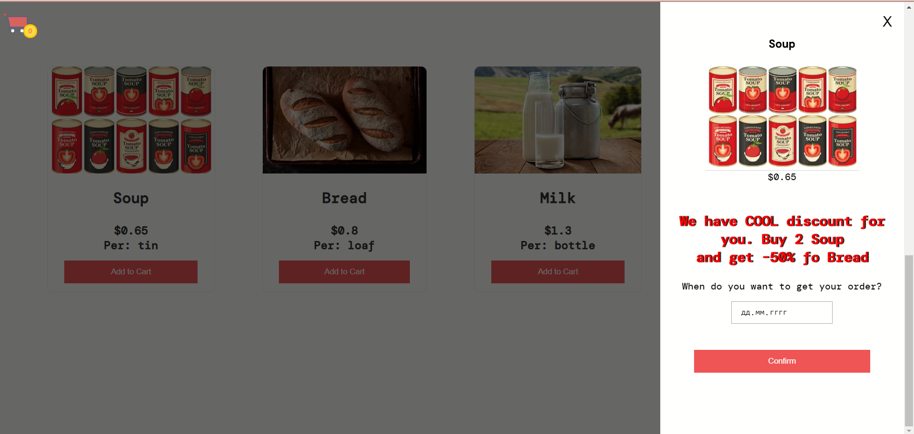
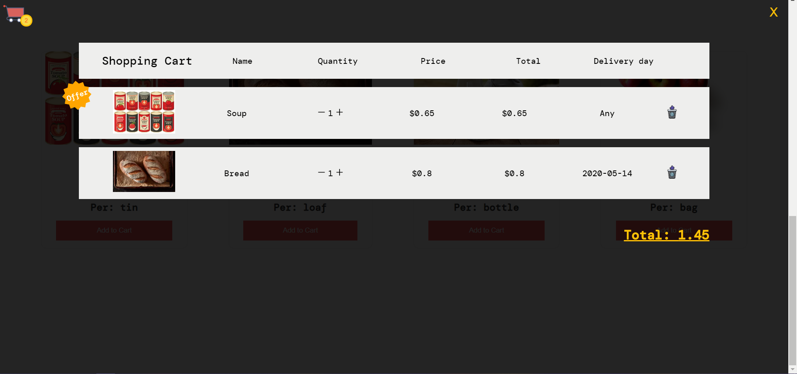

This project was bootstrapped with Create React App.

Available Scripts
In the project directory, you can run:

yarn start
Runs the app in the development mode.
Open http://localhost:3000 to view it in the browser.

yarn test
Launches the test runner in the interactive watch mode.

yarn build
Builds the app for production to the build folder.

## Learn More

 Main

Goods

Modal

Basket
